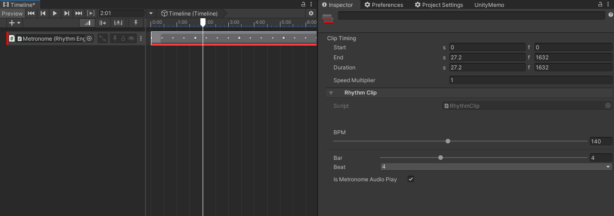
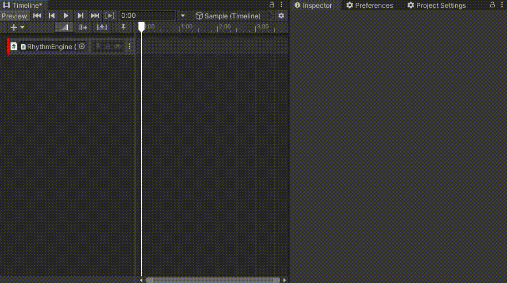

# RhythmTimeline ver1.0
RhythmTimeline is useful when you want to create a production that is synchronized with music in a timeline.

# Usage
- Create GameObject with **RhythmEngine** Component.
- Bind the GameObject with RhythmTimeline Track.
- Create Timeline Clip and Set BPM, Bar and Beat.

# TODO
- Editor Preview.

## Warning
- RhythmTimeline doesn't work with WebGL.